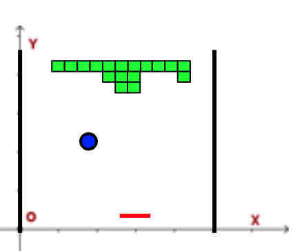

# Day 13: Care Package
https://adventofcode.com/2019/day/13

## Part 1
https://adventofcode.com/2019/day/13#part1

### Description
As you ponder the solitude of space and the ever-increasing three-hour roundtrip for messages between you and Earth, you notice that the Space Mail Indicator Light is blinking. To help keep you sane, the Elves have sent you a care package.

It's a new game for the ship's [arcade cabinet](https://en.wikipedia.org/wiki/Arcade_cabinet)! Unfortunately, the arcade is **all the way** on the other end of the ship. Surely, it won't be hard to build your own - the care package even comes with schematics.

The arcade cabinet runs [Intcode](https://adventofcode.com/2019/day/9) software like the game the Elves sent (your puzzle input). It has a primitive screen capable of drawing square **tiles** on a grid. The software draws tiles to the screen with output instructions: every three output instructions specify the `x` position (distance from the left), `y` position (distance from the top), and `tile id`. The `tile id` is interpreted as follows:
* `0` is an **empty** tile. No game object appears in this tile.
* `1` is a **wall** tile. Walls are indestructible barriers.
* `2` is a **block** tile. Blocks can be broken by the ball.
* `3` is a **horizontal paddle** tile. The paddle is indestructible.
* `4` is a **ball** tile. The ball moves diagonally and bounces off objects.

For example, a sequence of output values like `1,2,3,6,5,4` would draw a **horizontal paddle** tile (`1` tile from the left and `2` tiles from the top) and a **ball** tile (`6` tiles from the left and `5` tiles from the top).

Start the game. **How many block tiles are on the screen when the game exits?**

### Solution
To solve this problem, we use the **intcode_program**. With the intcode_program, we get **outputs of 3 values** (X position, Y position and tile, respectively) in a loop. When intcode_program generates **less than 3 output values**, loop stop and return all tiles generated by intcode_program. **Number of block tiles** is the final result.

Result for my input data is: `348`

## Part 2
https://adventofcode.com/2019/day/13#part2

### Description
The game didn't run because you didn't put in any quarters. Unfortunately, you did not bring any quarters. Memory address `0` represents the number of quarters that have been inserted; set it to `2` to play for free.

The arcade cabinet has a [joystick](https://en.wikipedia.org/wiki/Joystick) that can move left and right. The software reads the position of the joystick with input instructions:
* If the joystick is in the **neutral position**, provide `0`.
* If the joystick is **tilted to the left**, provide `-1`.
* If the joystick is **tilted to the right**, provide `1`.

The arcade cabinet also has a [segment display](https://en.wikipedia.org/wiki/Display_device#Segment_displays) capable of showing a single number that represents the player's current score. When three output instructions specify `X=-1, Y=0`, the third output instruction is not a tile; the value instead specifies the new score to show in the segment display. For example, a sequence of output values like `-1,0,12345` would show `12345` as the player's current score.

Beat the game by breaking all the blocks. **What is your score after the last block is broken?**

### Solution
To solve this part, let's see a figure with elements of this problem:

    

In this figure, we have a **joystick to move** the horizontal paddle (`red`). The objective is hit the ball (`blue`) to reject the ball and destroy another block tile (`green`). The input for joystick **starts with `0`** and this **value can change** during the execution. **Each cycle of the loop** we give corresponding input value to intcode_program.

In this case, if we get the position `(-1,0)`, the third value is the **new score**. Otherwise, we **store obtained tile** and then, we **update current position of horizontal paddle** if the tile is `3` or we **change the input of joystick** if the tile is `4`:
* `+1`: If the position of the ball is greater than position of horizontal paddle.
* `0`: If the position of the ball is equal to position of horizontal paddle.
* `-1`: If the position of the ball is less than position of horizontal paddle.

**Last obtained score** is the obtained result.

Result for my input data is: `16999`